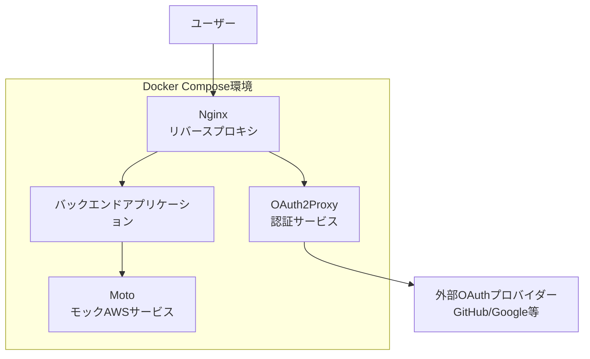
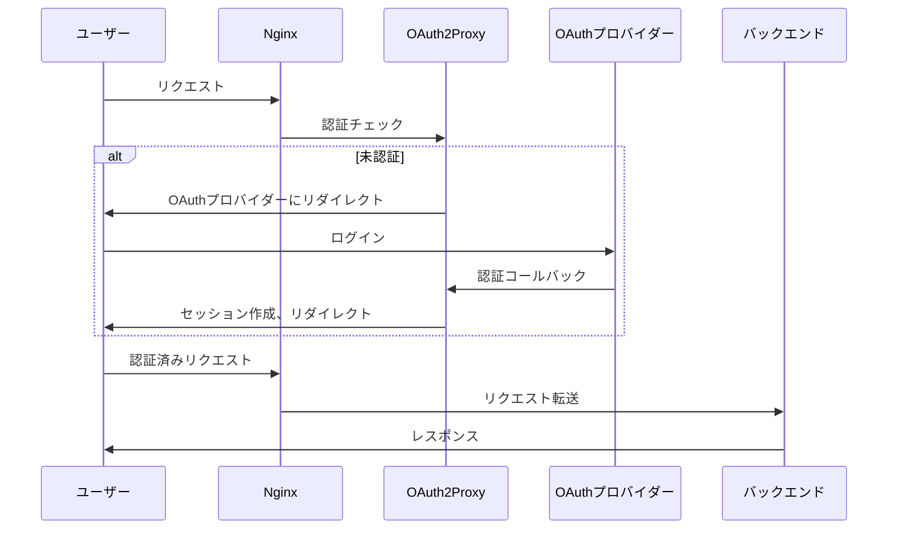

# 設計書

## 概要

この設計では、Docker Composeを使用してNginx、Moto、OAuth2Proxyを統合したOAuth認証環境を構築します。Nginxがリバースプロキシとして機能し、OAuth2ProxyがOAuth認証を処理し、MotoがモックAWSサービスを提供する3層アーキテクチャを実装します。

## アーキテクチャ

### システム構成図



### 認証フロー



## コンポーネントと インターフェース

### 1. Nginx（リバースプロキシ）

**役割:**
- 外部からの全リクエストのエントリポイント
- OAuth2Proxyとバックエンドサービスへのルーティング
- SSL終端（オプション）

**設定:**
- ポート80/443でリッスン
- `/oauth2/`パスをOAuth2Proxyにプロキシ
- 認証済みリクエストをバックエンドにプロキシ
- 適切なヘッダーの転送

### 2. OAuth2Proxy（認証サービス）

**役割:**
- OAuth認証の処理
- セッション管理
- 認証状態の検証

**設定:**
- 内部ポート4180でリッスン
- OAuthプロバイダー設定（GitHub、Google等）
- セッションストレージ設定
- 認証後のリダイレクト設定

### 3. Moto（モックAWSサービス）

**役割:**
- AWS APIのモック実装
- S3、DynamoDB、SQS等のサービス提供
- テスト用データの永続化

**設定:**
- motoserver/moto:5.1.9イメージを使用
- ポート5000でリッスン
- 必要なAWSサービスの有効化

### 4. バックエンドアプリケーション（サンプル）

**役割:**
- 保護されたリソースの提供
- Motoを使用したAWS統合のデモ

## データモデル

### 環境変数

```yaml
# OAuth2Proxy設定
OAUTH2_PROXY_CLIENT_ID: "your-oauth-client-id"
OAUTH2_PROXY_CLIENT_SECRET: "your-oauth-client-secret"
OAUTH2_PROXY_COOKIE_SECRET: "random-32-char-string"
OAUTH2_PROXY_PROVIDER: "github"  # または google, oidc等
OAUTH2_PROXY_EMAIL_DOMAINS: "*"
OAUTH2_PROXY_UPSTREAM: "http://backend:8080"
OAUTH2_PROXY_HTTP_ADDRESS: "0.0.0.0:4180"

# Moto設定
MOTO_HOST: "0.0.0.0"
MOTO_PORT: "5000"

# AWS設定（Moto用）
AWS_ACCESS_KEY_ID: "testing"
AWS_SECRET_ACCESS_KEY: "testing"
AWS_DEFAULT_REGION: "us-east-1"
AWS_ENDPOINT_URL: "http://moto:5000"
```

### Docker Composeサービス定義

```yaml
services:
  nginx:
    image: nginx:alpine
    ports:
      - "80:80"
    volumes:
      - ./nginx.conf:/etc/nginx/nginx.conf
    depends_on:
      - oauth2-proxy
      - backend

  oauth2-proxy:
    image: quay.io/oauth2-proxy/oauth2-proxy:latest
    environment:
      - OAUTH2_PROXY_CLIENT_ID=${OAUTH2_PROXY_CLIENT_ID}
      - OAUTH2_PROXY_CLIENT_SECRET=${OAUTH2_PROXY_CLIENT_SECRET}
      # その他の環境変数
    depends_on:
      - backend

  moto:
    image: motoserver/moto:5.1.9
    ports:
      - "5000:5000"
    environment:
      - MOTO_HOST=0.0.0.0
      - MOTO_PORT=5000

  backend:
    build: ./backend
    environment:
      - AWS_ENDPOINT_URL=http://moto:5000
    depends_on:
      - moto
```

## エラーハンドリング

### 1. 認証エラー

**シナリオ:** OAuth認証失敗
- **対応:** OAuth2Proxyがエラーページを表示
- **ログ:** 認証失敗の詳細をログに記録
- **リトライ:** ユーザーに再認証オプションを提供

### 2. サービス接続エラー

**シナリオ:** バックエンドサービスが利用不可
- **対応:** Nginxが502 Bad Gatewayを返す
- **ヘルスチェック:** Docker Composeのヘルスチェックで監視
- **自動復旧:** サービスの自動再起動

### 3. Moto接続エラー

**シナリオ:** MotoサービスへのAWS API呼び出し失敗
- **対応:** バックエンドアプリケーションでエラーハンドリング
- **フォールバック:** デフォルト値またはキャッシュデータの使用

## テスト戦略

### 1. 統合テスト

**OAuth認証フローテスト:**
- 未認証ユーザーのリダイレクト確認
- 認証後のアクセス許可確認
- セッション期限切れの動作確認

**サービス間通信テスト:**
- Nginx → OAuth2Proxy通信
- Nginx → バックエンド通信
- バックエンド → Moto通信

### 2. 設定テスト

**Docker Compose起動テスト:**
- 全サービスの正常起動確認
- ネットワーク接続確認
- 環境変数の正しい設定確認

### 3. セキュリティテスト

**認証バイパステスト:**
- 直接バックエンドアクセスの防止確認
- セッション改ざんの検出確認

### 4. パフォーマンステスト

**負荷テスト:**
- 同時認証リクエストの処理確認
- リソース使用量の監視

## セキュリティ考慮事項

### 1. セッション管理
- セキュアなクッキー設定
- 適切なセッション有効期限
- CSRF保護

### 2. ネットワークセキュリティ
- 内部サービス間の通信制限
- 不要なポートの非公開
- Docker networkの分離

### 3. 秘密情報管理
- 環境変数での秘密情報管理
- Docker secretsの使用（本番環境）
- 設定ファイルの適切な権限設定

## 運用考慮事項

### 1. ログ管理
- 各サービスのログ出力設定
- 集約ログ管理（オプション）
- ログローテーション

### 2. 監視
- ヘルスチェックエンドポイント
- メトリクス収集
- アラート設定

### 3. バックアップ
- Motoデータの永続化
- 設定ファイルのバージョン管理